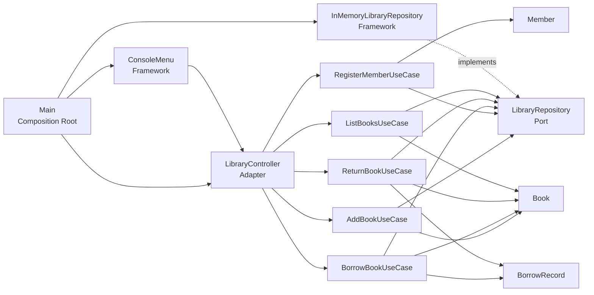

# Library Book Borrowing System in Java

A small **Java console application** designed to demonstrate **Clean Architecture**, **SOLID-informed design**, and clear separation of responsibilities in a simple library domain.

Its main value is in the way the code is structured, how responsibilities are separated, and how business rules are placed within the application flow. The implementation is intentionally lightweight, using plain Java and in-memory storage to keep the focus on design.

## Why this project matters

This repository demonstrates software engineering design decisions more than feature breadth.

It shows:

- use-case driven design instead of putting logic in the user interface
- separation of concerns across domain, workflow, adapter, and framework layers
- dependency inversion through a repository interface
- explicit handling of business rules such as duplicate ISBN checks and borrow limits
- a clear path for extension from a console prototype toward a more complete application

The project demonstrates code organisation, separation of concerns, and deliberate placement of business rules within the application layer.

## Overview

The application supports a small library workflow:

- add a book
- register a member
- borrow a book
- return a book
- view currently available books

The project also enforces several simple business rules:

- each book must have a unique ISBN
- the library can hold a maximum of **10 books**
- each member can have a maximum of **10 active borrows**
- a book cannot be borrowed when no copies remain

## Technical highlights

- Plain Java implementation with no external dependencies
- Clean Architecture folder structure using `entities`, `usecases`, `adapters`, `frameworks`, and `main`
- Repository abstraction via `LibraryRepository`
- In-memory storage through `InMemoryLibraryRepository`
- UUID-based identifiers with short-ID support in the console flow for easier input
- Use-case classes that keep business logic out of the user interface

## Architecture

The code follows a simplified **Clean Architecture** approach.

### Mermaid diagram



### Layer responsibilities

**Entities**
- `Book`
- `Member`
- `BorrowRecord`

These classes hold the core domain state and essential domain behaviour.

**Use Cases**
- `AddBookUseCase`
- `RegisterMemberUseCase`
- `BorrowBookUseCase`
- `ReturnBookUseCase`
- `ListBooksUseCase`
- `LibraryRepository` as the abstraction used by the workflows

These classes coordinate application behaviour and enforce business rules.

**Adapters**
- `LibraryController`

This class translates menu actions into use-case calls and returns user-facing success or error messages.

**Frameworks**
- `ConsoleMenu`
- `InMemoryLibraryRepository`

These classes handle implementation details at the system boundary. The console menu manages input and output, while the repository implementation provides in-memory storage.

**Composition Root**
- `Main`

This wires dependencies together and performs basic dependency injection.

## Project structure

```text
src/
├── adapters/
│   └── LibraryController.java
├── entities/
│   ├── Book.java
│   ├── BorrowRecord.java
│   └── Member.java
├── frameworks/
│   ├── ConsoleMenu.java
│   └── InMemoryLibraryRepository.java
├── main/
│   └── Main.java
└── usecases/
    ├── AddBookUseCase.java
    ├── BorrowBookUseCase.java
    ├── LibraryRepository.java
    ├── ListBooksUseCase.java
    ├── RegisterMemberUseCase.java
    └── ReturnBookUseCase.java
```

## Key engineering decisions

### 1. Keep business rules in the use-case layer

Rules such as maximum books, duplicate ISBN checks, borrow limits, and validation are handled in the use cases rather than in the console menu.

That makes the behaviour easier to test, reason about, and reuse if the application later gains another interface such as a REST API or GUI.

### 2. Depend on an interface, not storage details

The use cases depend on `LibraryRepository`, not directly on `InMemoryLibraryRepository`.

That reduces coupling and makes it easier to replace the current storage approach with a file-based or database-backed implementation later.

### 3. Let the domain model own simple state changes

`Book.borrow()` and `Book.returnBook()` manage the quantity and availability state of a book.

This keeps low-level state transitions close to the entity they belong to instead of scattering them across controller or UI code.

### 4. Keep the UI thin

`ConsoleMenu` collects user input and displays messages, but it does not contain the main workflow logic.

This is a small but important design choice because it avoids mixing presentation concerns with application behaviour.

### 5. Optimise usability without weakening the model

The application stores full UUIDs internally but allows short prefixes in the console flow.

That improves usability during manual demos and testing while preserving globally unique internal identifiers.

## SOLID principles in practice

The project also applies key SOLID principles at a small scale:

- **Single Responsibility Principle (SRP)**: entities, use cases, controller, repository, and menu each have a distinct concern
- **Open/Closed Principle (OCP)**: workflows depend on `LibraryRepository`, which allows new repository implementations without rewriting use-case logic
- **Liskov Substitution Principle (LSP)**: any repository implementation that honours the same contract should be usable by the workflows
- **Interface Segregation Principle (ISP)**: the current interface is intentionally simple for the project scope, though it could be split further in a larger system
- **Dependency Inversion Principle (DIP)**: high-level use cases depend on an abstraction and receive the concrete dependency through constructor injection in `Main`

## Demonstrated business rules

The following business rules are enforced in code:

- `AddBookUseCase` prevents duplicate ISBN entries
- `AddBookUseCase` enforces a maximum of **10 books** in the library
- `BorrowBookUseCase` enforces a maximum of **10 active borrows** per member
- `BorrowBookUseCase` prevents borrowing when quantity reaches zero
- `ReturnBookUseCase` closes the open borrow record and restores quantity
- `ListBooksUseCase` returns only books that are currently available

## Example walkthrough

A typical demo flow is:

1. add two books
2. register a member
3. view available books
4. borrow a book
5. return a book
6. demonstrate the **MAX_BORROWS_PER_MEMBER** rule

This gives a simple end-to-end demonstration of how the architecture supports the business rules.

## How to compile and run

This project can be compiled directly using `javac`.

### Compile

```bash
javac -d out $(find src -name "*.java")
```

### Run

```bash
java -cp out main.Main
```

## What I learned

This project reinforced several practical software engineering lessons for me:

- **Structure matters even in small projects.** A console application can still benefit from clear boundaries and deliberate design choices.
- **Business rules are easier to manage when they live in use cases.** Keeping workflow logic out of the UI made the code easier to follow and easier to change.
- **Interfaces make future change cheaper.** Using `LibraryRepository` gave me a cleaner seam between workflow code and storage code.
- **Domain behaviour should stay close to the domain.** Letting `Book` manage its own quantity and status changes kept the code more coherent.
- **Good architecture improves clarity.** The project became easier to explain and reason about because each layer had a clear role.
- **Trade-offs are part of engineering.** In-memory storage was enough for the scope of the project, but the design still leaves room for persistence, testing, and interface changes later.

## Limitations

This is a deliberately small project, so some trade-offs were intentional:

- in-memory storage only
- no persistence across application restarts
- no automated unit or integration tests
- no Maven or Gradle build file
- console interface only
- one broad repository interface for simplicity
- minimal operational concerns such as logging or configuration

These limitations define the current scope of the project and highlight the most natural areas for future extension.

